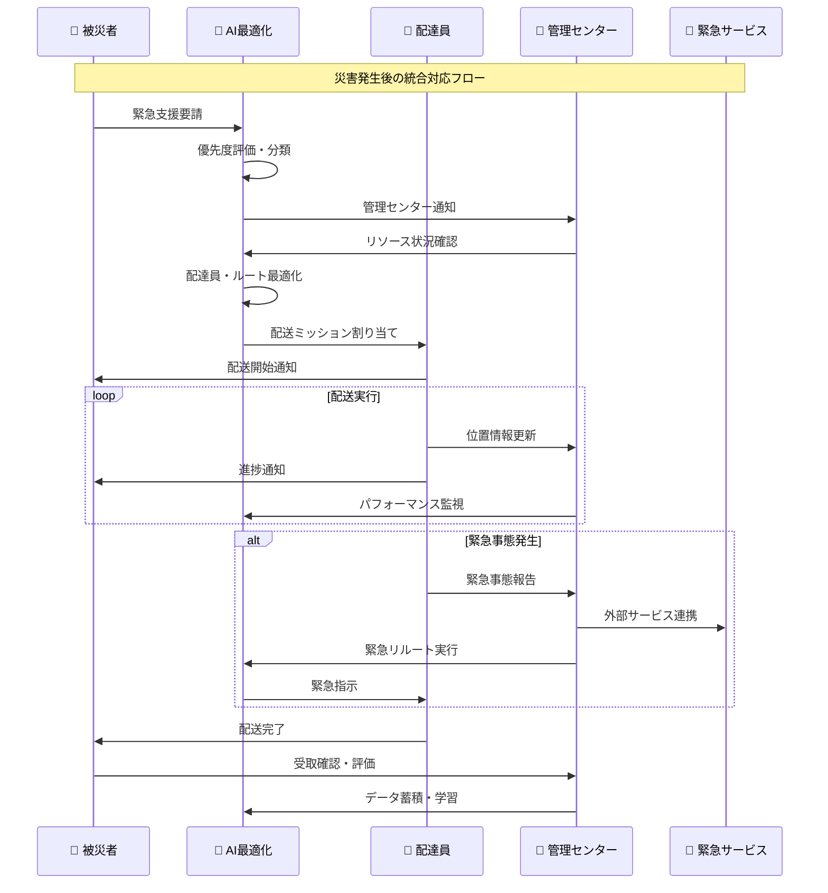

# 🎯 災害配送システム ユースケース設計書

## 👥 アクター定義

### 1. 🆘 被災者 (Victim)
- **属性**: 災害により支援が必要な個人・家族
- **ニーズ**: 緊急物資、医療支援、避難支援、安否確認
- **技術レベル**: 基本的なスマートフォン操作

### 2. 🚚 配達員 (Delivery Person)
- **属性**: 訓練された配送専門員
- **責任**: 効率的な物資配送、被災者との適切なコミュニケーション
- **技術レベル**: 中級〜上級アプリ操作

### 3. 👮 災害対策本部 (Emergency Management Center)
- **属性**: 災害対応統制機関
- **責任**: 全体調整、リソース配分、緊急事態対応
- **技術レベル**: 専門システム操作

### 4. 🤖 AI最適化エンジン (AI System)
- **属性**: 自動化された配送最適化システム
- **責任**: ルート計算、リソース配分、予測分析

## 🎬 主要ユースケースシナリオ

### 📋 UC-001: 緊急支援要請作成

**アクター**: 被災者  
**前提条件**: アプリインストール済み、位置情報許可済み  
**目標**: 必要な支援を迅速に要請する

#### 🔄 メインフロー
```
1. 被災者がアプリを起動
2. 現在位置を自動取得（GPS + 手動補正可能）
3. 支援種別を選択
   - 🍞 食料（米、パン、水等）
   - 💊 医薬品（処方薬、救急用品）
   - 🏠 生活用品（毛布、衣類等）
   - 🚨 緊急医療支援
4. 詳細情報入力
   - 家族構成
   - 特別なニーズ（アレルギー、介護等）
   - 緊急度自己評価
5. 連絡先情報確認
6. 要請送信
7. 受付確認 + 推定対応時間通知
```

#### 🔀 代替フロー
- **A1**: GPS取得失敗 → 手動位置入力
- **A2**: ネットワーク障害 → オフライン一時保存
- **A3**: 緊急事態 → 優先処理ルート

#### 📊 成功基準
- 要請作成時間: < 3分
- 位置精度: ±100m以内
- システム応答: < 5秒

---

### 🗺️ UC-002: AI配送ルート最適化

**アクター**: AI最適化エンジン  
**トリガー**: 新規要請受信または配達員位置更新  
**目標**: 最も効率的な配送ルートを計算

#### 🧠 最適化アルゴリズム
```dart
class AIRouteOptimizer {
  /// 🧬 遺伝的アルゴリズムによる配送ルート最適化
  static Future<OptimizedRoute> optimizeDeliveryRoute({
    required List<DeliveryRequest> requests,
    required List<DeliveryPerson> availableDeliveryPersons,
    required TrafficData currentTrafficData,
    required WeatherData weatherConditions,
  }) async {
    
    // 1. 初期集団生成（複数の配送パターン）
    List<RouteGenome> population = _generateInitialPopulation(
      requests: requests,
      deliveryPersons: availableDeliveryPersons,
    );
    
    // 2. 反復進化処理
    for (int generation = 0; generation < MAX_GENERATIONS; generation++) {
      // フィットネス評価（配送効率スコア）
      for (var genome in population) {
        genome.fitness = _calculateFitness(
          genome: genome,
          trafficData: currentTrafficData,
          weather: weatherConditions,
        );
      }
      
      // 選択・交叉・突然変異
      population = _evolvePopulation(population);
      
      // 収束判定
      if (_hasConverged(population)) break;
    }
    
    // 3. 最適解の選択
    final bestRoute = population.reduce((a, b) => 
      a.fitness > b.fitness ? a : b
    );
    
    return OptimizedRoute.fromGenome(bestRoute);
  }
  
  /// 📊 フィットネス計算（配送効率指標）
  static double _calculateFitness(RouteGenome genome) {
    double score = 0.0;
    
    // 配送時間最小化 (40%)
    score += (1.0 / genome.totalDeliveryTime) * 0.4;
    
    // 緊急度優先 (30%)
    score += genome.priorityScore * 0.3;
    
    // 燃料効率 (20%)
    score += genome.fuelEfficiency * 0.2;
    
    // 配達員負荷分散 (10%)
    score += genome.loadBalanceScore * 0.1;
    
    return score;
  }
}
```

#### 🎯 最適化要素
1. **時間効率**: 配送時間最小化
2. **緊急度**: 生命に関わる要請の優先処理
3. **リソース効率**: 燃料・人員の効率的活用
4. **公平性**: 地域・時間の均等配分

---

### 📱 UC-003: 配達員配送実行

**アクター**: 配達員  
**前提条件**: 認証済み、車両準備完了  
**目標**: 割り当てられた配送を効率的に完了

#### 🔄 詳細フロー
```
1. 配達員ログイン
2. 本日の配送ミッション確認
   - 配送先リスト
   - 最適化されたルート表示
   - 各要請の詳細情報
3. 物資積み込み確認
   - バーコードスキャン
   - 数量確認
   - 特別配慮事項確認
4. 配送開始
   - GPS追跡開始
   - リアルタイム位置共有
   - ナビゲーション開始
5. 各配送地点での処理
   - 到着通知
   - 被災者との対面確認
   - 物資引き渡し
   - デジタル署名取得
   - 写真記録（プライバシー配慮）
6. 配送完了報告
   - 全配送完了確認
   - パフォーマンス記録
   - 次回ミッション準備
```

#### 📊 リアルタイム監視項目
- **位置情報**: 10秒間隔更新
- **配送進捗**: 各地点での状況更新
- **異常検知**: 予定ルートからの逸脱、長時間停止
- **コミュニケーション**: 被災者・本部との連絡

---

### 🚨 UC-004: 緊急事態対応

**アクター**: 全アクター  
**トリガー**: 緊急事態発生（医療緊急、災害拡大等）  
**目標**: 迅速かつ適切な緊急対応

#### ⚡ 緊急事態分類
```dart
enum EmergencyType {
  medical,        // 医療緊急事態
  disaster,       // 災害拡大
  security,       // 治安悪化
  infrastructure, // インフラ障害
  system,         // システム障害
}

class EmergencyResponse {
  /// 🚨 緊急事態自動検知システム
  static Future<void> detectAndRespond() async {
    // 1. 異常パターン検知
    final anomalies = await _detectAnomalies([
      LocationAnomalyDetector(),    // 位置情報異常
      CommunicationGapDetector(),   // 通信断絶
      MedicalKeywordDetector(),     // 医療関連キーワード
      TrafficDisruptionDetector(),  // 交通障害
    ]);
    
    // 2. 緊急度評価
    for (final anomaly in anomalies) {
      final severity = await _evaluateSeverity(anomaly);
      
      if (severity >= EmergencySeverity.high) {
        // 3. 自動エスカレーション
        await _triggerEmergencyProtocol(anomaly, severity);
      }
    }
  }
  
  /// 📞 緊急プロトコル実行
  static Future<void> _triggerEmergencyProtocol(
    Anomaly anomaly, 
    EmergencySeverity severity
  ) async {
    // 即座に関係者に通知
    await NotificationService.sendEmergencyAlert([
      PushNotification(
        recipients: _getNearbyDeliveryPersons(anomaly.location),
        priority: NotificationPriority.critical,
        message: "緊急事態発生: ${anomaly.description}",
      ),
      AdminAlert(
        type: AlertType.emergency,
        location: anomaly.location,
        severity: severity,
      ),
    ]);
    
    // 緊急サービスとの連携
    if (severity >= EmergencySeverity.critical) {
      await ExternalServiceConnector.notifyEmergencyServices(anomaly);
    }
    
    // リソース再配分
    await RouteOptimizer.emergencyReoptimization(
      emergencyLocation: anomaly.location,
      affectedRadius: _calculateAffectedRadius(severity),
    );
  }
}
```

#### 🔄 緊急対応フロー
1. **検知**: AI異常検知 + 手動報告
2. **評価**: 緊急度自動評価
3. **通知**: 関係者即座通知
4. **対応**: リソース緊急再配分
5. **連携**: 外部緊急サービス連携
6. **追跡**: 対応状況リアルタイム監視

---

### 📊 UC-005: 統合管理ダッシュボード

**アクター**: 災害対策本部  
**目標**: 全体状況把握と戦略的意思決定

#### 📈 ダッシュボード機能
```typescript
interface AdminDashboardData {
  // リアルタイム統計
  realTimeStats: {
    activeRequests: number;
    ongoingDeliveries: number;
    availableDeliveryPersons: number;
    completedToday: number;
    averageResponseTime: number; // minutes
  };
  
  // 地理的分析
  geographicAnalysis: {
    hotspots: HotspotArea[];        // 要請集中地域
    coverage: CoverageAnalysis;     // カバレッジ分析
    routeEfficiency: RouteMetrics[]; // ルート効率
  };
  
  // パフォーマンス分析
  performanceMetrics: {
    deliveryPersonRankings: DeliveryPersonStats[];
    systemUptime: number;
    averageFuelEfficiency: number;
    customerSatisfactionScore: number;
  };
  
  // 予測分析
  predictiveAnalytics: {
    demandForecast: DemandPrediction[];   // 需要予測
    resourceNeeds: ResourcePlanning[];    // リソース計画
    riskAssessment: RiskFactor[];         // リスク評価
  };
}
```

#### 🎯 意思決定支援機能
1. **リアルタイム監視**: 全配送状況可視化
2. **予測分析**: AI需要予測・リソース計画
3. **アラート管理**: 異常事態自動検知
4. **リソース最適化**: 人員・物資配分調整
5. **外部連携**: 政府機関・NGO連携

---

## 🔄 統合ユースケース: エンドツーエンド配送

### 🎬 完全統合シナリオ



## 📊 成功指標 (KPI)

### ⏱️ 効率性指標
- **平均応答時間**: < 30分
- **配送完了率**: > 95%
- **ルート最適化効果**: 20%以上の時間短縮

### 🎯 効果性指標
- **被災者満足度**: > 4.5/5.0
- **緊急事態対応時間**: < 10分
- **システム可用性**: > 99.9%

### 📈 影響力指標
- **支援カバレッジ**: 災害地域の80%以上
- **外部機関連携数**: 政府・NGO 10機関以上
- **コスト効率**: 従来手法比30%削減

この統合設計により、被災者のニーズに迅速かつ効率的に対応し、災害時の物資配送を革新的に改善できるシステムが実現できます。